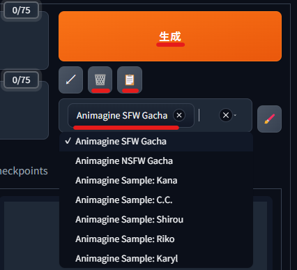

# EasySdxlWebUi

<!-- 概要は[こちら](https://twitter.com/Zuntan03/status/1744195658029117523)。 -->

[ANIMAGINE XL 3.0](https://cagliostrolab.net/posts/animagine-xl-v3-release) ([HuggingFace](https://huggingface.co/cagliostrolab/animagine-xl-3.0)) を [Stable Diffusion web UI](https://github.com/AUTOMATIC1111/stable-diffusion-webui) で使えるようにする簡単なインストーラーです。  
bat を実行するだけの簡単インストールで、Python や Git をインストールする必要はありません。  
一通りの拡張機能とワイルドカードもインストールします。

## インストール

Geforce RTX 3060 **VRAM 12GB** 以上を搭載した Widows PC で簡単に動作します。  
未成年の方は利用しないでください。

1. [Install-EasySdxlWebUi.bat](https://github.com/Zuntan03/EasySdxlWebUi/raw/main/SdxlWebUi/setup/Install-EasySdxlWebUi.bat) を右クリックから保存して、インストール先のフォルダで実行します。  
 **インストール先のフォルダは、スペースを含まない英数字のみの浅いパス (`C:\EasySdxlWebUi\` など) にしてください。**
	- **`WindowsによってPCが保護されました` と表示されたら、`詳細表示` から `実行` します。**
2. ファイルの配布元を `Ctrl+Click` で確認して、問題がなければ `y` を入力してください。
3. しばらく待ってインストールが終わると、Web ブラウザに Stable Diffusion web UI が表示されます。
	- 次回以降は `SdxlWebUi.bat` で Stable Diffusion web UI を起動できます。

### インストールのトラブル対策

- アバストなどのウィルスチェックソフトが有効だと、インストールに失敗する場合があります。
- Windows PC の管理者権限がないと、インストールに失敗する場合があります。
- プロキシ環境などでインストールに失敗する場合は、[Git for Windows](https://gitforwindows.org/) と [Python 3.10.6](https://www.python.org/ftp/python/3.10.6/python-3.10.6-amd64.exe) を[パスを通してインストール](https://github.com/Zuntan03/SdWebUiTutorial/blob/main/_/doc/SdWebUiInstall/SdWebUiInstall.md#git-for-windows-%E3%81%AE%E3%82%A4%E3%83%B3%E3%82%B9%E3%83%88%E3%83%BC%E3%83%AB)してから、最初から EasySdxlWebUi をインストールし直してください。

## 使いかた

Stable Diffusion web UI の基本的な使い方については、Web にある大量の情報から最近更新された記事を参考にしてください。

1. 画面右側の `生成ボタン` の下にあるスタイル選択欄で `Animagine Sample:` で始まる Animagine 公式サンプルか、`Animagine SWF Gacha` を選択します。
2. すぐ上の `クリップボードボタン` で左側のプロンプト欄にスタイルが適用されます。
	- 先にプロンプトを入力していた場合は、`ゴミ箱ボタン` で先にプロンプト欄をクリアしておきます。
3. `生成ボタン` で画像を生成します。
	- `ImageViewer.bat` を実行すると、生成画像をお好みのサイズでプレビューできます。
4. `ゴミ箱ボタン` でプロンプトを削除して、別のスタイルを選んで生成することもできます。
	- スタイル選択欄でスタイルを選択しているだけで、スタイルのプロンプトが生成に適用されます。  
	プロンプト欄とスタイル選択欄でのプロンプト二重適用にご注意ください。

プロンプトへの応答性が高まった影響か、ランダムなガチャプロンプトで絵が崩れやすい印象です。  
が、当たりの破壊力も高まっています。

Geforce RTX 3060 12GB にて、アップスケールと ADetailer 込みで 25秒程度で生成できています。  
生成時間が長い場合は `NVIDIA コントロール パネル` で `CUDA - Sysmem Fall Back Policy` を `Prefer No Sysmem Fallback` にする ([日本語記事](https://news.mynavi.jp/article/20231101-2808224/), [公式英語サポート](https://nvidia.custhelp.com/app/answers/detail/a_id/5490/~/system-memory-fallback-for-stable-diffusion)) ことで、改善する可能性があります。

## Animagine のルール

[Animagine 公式](https://cagliostrolab.net/posts/animagine-xl-v3-release) で紹介されているルールです。  
起動時の設定やスタイルは、LCM 使用で設定済みです。

### プロンプト

- プロンプトの最初に 1girl か 1boy、キャラ名、作品名と並べます。
	- `__animagine/character__` で公式のキャラリストからランダム指定ができます。
- プロンプトの真ん中で色々指定します。
	- 手の姿勢は `waving`, `double v`, `v`, `pointing at viewer`, `hands up`, `rabbit pose`, `shushing`, `index finger raised` などで指定できます。
	- 絵の年代は `newest`, `early`, `mid`, `late`, `oldest` で指定できます。
- プロンプトの末尾に `masterpiece, best quality` のクオリティタグを入れます。
	- SFW のつもりなのに NSFW が出てしまう場合は `rating: general` を追加します。
	- NSFW の場合は `nsfw` や `rating: sensitive` と共にプロンプト前半に入れてもよいかもしれません。
- ネガティブプロンプトには `lowres, bad anatomy, bad hands, text, error, missing fingers, extra digit, fewer digits, cropped, worst quality, low quality, normal quality, jpeg artifacts, signature, watermark, username, blurry, artist name` を指定します。
	- SWF の場合は先頭に `nsfw` を追加します。

### パラメータ

- 画像サイズの幅と高さは `1024`x`1024`, `1152`x`896`, `1216`x`832`, `1344`x`768`, `1536`x`640` のいずれかから選びます。
	- サイズの幅と高さは入れ替えられます。  
	つまり `896`x`1152`, `832`x`1216`, `768`x`1344`, `640`x`1536` からも選べます。
- `高解像度補助`: `有効`
	- アップスケール倍率: `1.5`（`2.0` も可能だが `1.5` が無難な印象）
- `Enable Adetailer`: `有効`
- `Enable Tiled VAE`: `有効`

- LCM LoRA `<lora:lcm-animagine-3:1>` を使う場合（手元調査）
	- サンプリング方法: `LCM`
	- サンプリングステップ数: `6`
	- 高解像度でのステップ数: `4`
	- CFG スケール: `1.65`

- LCM LoRA を使わない場合
	- 外出や寝る前などに、`停止するまで生成を続ける` を仕込む際にでも。
	- サンプリング方法: `Euler a` が作者推奨
	- サンプリングステップ数: `28` あたり
	- 高解像度でのステップ数: `14` あたり
	- CFG スケール: `(5~) 7`

## TIPS

- モデルや LoRA などを別のフォルダにあるものを参照したい場合は、`SdxlWebUi.bat` の `CKPT_DIR` や `LORA_DIR` の値を書き換えます。
- ControlNet のモデルを追加したい場合は、`SdxlWebUi/ControlNet/Open-SdControlCollection.bat` を実行して、ダウンロードしたモデルを `SdxlWebUi/ControlNet/` に置いてください。
- `LamaCleaner(C|G)pu.bat` で [画像を手軽に修正できる Lama Cleaner](https://github.com/Zuntan03/SdWebUiTutorial/blob/main/_/doc/LamaCleaner/LamaCleaner.md) を利用できます。
	- 画像を生成しながら使う場合は CPU 版を、単体で使う場合は GPU 版を使用します。
set COMMANDLINE_ARGS=^
- VRAM が足りなくなった場合は `SdxlWebUi.bat` を書き換えて、`COMMANDLINE_ARGS` に `--medvram-sdxl` を追加すると VRAM 消費が下がります。
	- 生成が数割遅くなり、メインメモリの消費量も数GB 増えますので、必要になってから指定してください。

## fp8

Stable Diffusion web UI の dev ブランチで対応されている fp8 対応も試してみました。

- Stable Diffusion web UI の `config.json` に `"fp8_storage": "Enable for SDXL", "cache_fp16_weight": true,` を追加します。
	- `設定` からでも変更できます。
- LCM LoRA は `<lora:lcm-animagine-3:1.15>` と少し強めたほうが良さそうでした。
	- 生成される絵は fp16 と異なります。
- VRAM 消費は減りますが、一部の拡張機能がまだ fp8 に未対応で使用できませんでした。

絵の変化度合いと拡張機能の対応状況から、現時点では見送りました。  
正式リリースされる頃には、VRAM 8GB が実用に足るかもしれません。

## ライセンス

このリポジトリの内容は [MIT License](./LICENSE.txt) です。
