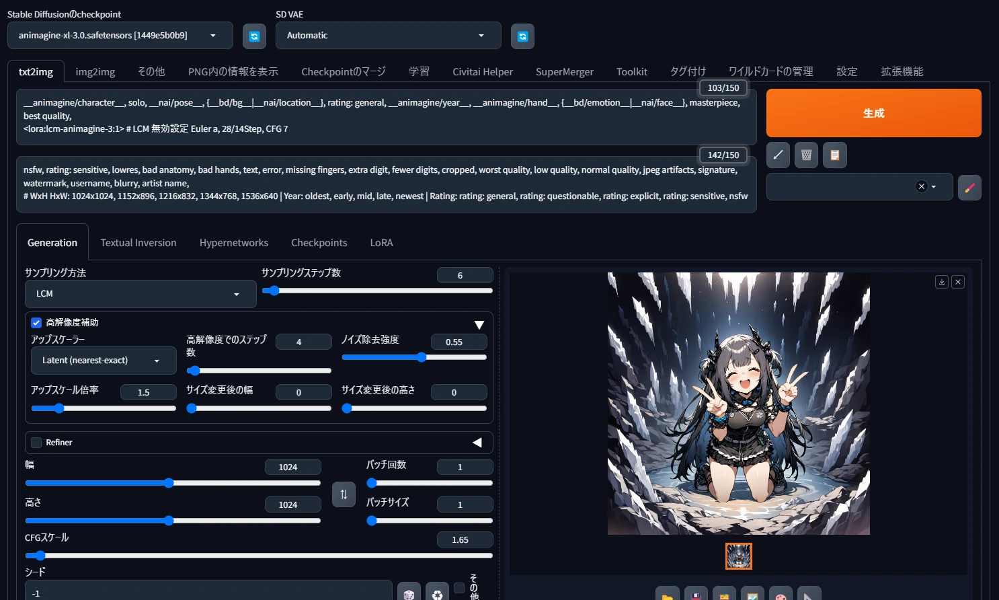

# EasySdxlWebUi

概要: [PC Watch (2/14)](https://twitter.com/Zuntan03/status/1757707024958464163), [forge (2/9)](https://twitter.com/Zuntan03/status/1755898971195900249), [AUTOMATIC1111 (1/14)](https://twitter.com/Zuntan03/status/1746=426606456127804)

EasySdxlWebUi は簡単に SDXL で画像を生成できるようにします。  

- ワンクリックインストーラーで古いパソコンでも動作する [forge 版](https://github.com/lllyasviel/stable-diffusion-webui-forge) と、実績のある [AUTOMATIC1111 版(a1111)](https://github.com/AUTOMATIC1111/stable-diffusion-webui) に両対応しており、簡単に使い始められます。
	- **forge と a1111 で多くの設定を共有しており、気軽に両方を使い分けられます。**
- 画像の生成にはインストールだけでなく、web UI の設定、拡張機能のインストールと設定、モデルなどの入手、適切なパラメータ設定などが必要になりますが、これも自動的に設定します。
	- **web UI の本体は通常の web UI と完全に同一ですので、経験が後々無駄になることもありません。**

**インストール方法は [こちら](https://github.com/Zuntan03/EasySdxlWebUi/wiki/EasySdxlWebUi-%E3%81%AE%E3%82%A4%E3%83%B3%E3%82%B9%E3%83%88%E3%83%BC%E3%83%AB)。**

## **[トラブルシューティング](https://github.com/Zuntan03/EasySdxlWebUi/wiki/%E3%83%88%E3%83%A9%E3%83%96%E3%83%AB%E3%82%B7%E3%83%A5%E3%83%BC%E3%83%86%E3%82%A3%E3%83%B3%E3%82%B0)**

- **拡張機能の更新時にエラーが発生した場合は、`SdxlWebUi/stable-diffusion-webui(-forge)/extensions/` にある拡張機能のフォルダを削除して再更新してください。**
- **ブラウザの自動起動でまれに操作不能となる不具合があります。**  
**`SdxlWebUi-(forge|a1111)-DisableAutoLaunch.bat` で起動し、[http://localhost:7860/](http://localhost:7860/) をブックマークして手動で開くことで回避できます。**

## 最近の主な更新

### 2024/07/04

- 環境によって forge の起動時に `ImportError: cannot import name 'packaging' from 'pkg_resources'` のエラーになる不具合を修正しました。

### 2024/06/26

- a1111 の fp8 を無効にしたことで VRAM が足りない環境のために `SdxlWebUi-a1111-MedVram.bat` を用意しました。
	- `--medvram-sdxl` オプション付きでの起動で、動作は遅くなりますが VRAM 不足を回避できます。
	- a1111 では [fp8 を有効にすると LoRA が複数適用できません](https://github.com/AUTOMATIC1111/stable-diffusion-webui/issues/15995)。

### 2024/06/12

- `JAX requires ml_dtypes version 0.4.0 or newer; installed version is 0.3.2.` エラーへの対処を入れました。
	- エラーが出ている場合は、更新時の `更新に時間がかかりますが、安全のために SdxlWebUi\venv-(forge|a1111)\ を削除しますか？` で削除してください。

### 2024/06/09

- forge の [互換性のない更新予告](https://github.com/lllyasviel/stable-diffusion-webui-forge/discussions/801) に備えて、バージョンを固定するようにしました。
	- [forge CFG1 と、a1111 高速化パッチ適用済の速度差](https://x.com/Zuntan03/status/1792702913456078878)
	- 『[Forge を高速な安定版として利用する](https://github.com/Zuntan03/EasySdxlWebUi/wiki/Forge-%E3%82%92%E9%AB%98%E9%80%9F%E3%81%AA%E5%AE%89%E5%AE%9A%E7%89%88%E3%81%A8%E3%81%97%E3%81%A6%E5%88%A9%E7%94%A8%E3%81%99%E3%82%8B)』

### 2024/06/08

- ドキュメントに『[複数キャラ画像の生成](https://github.com/Zuntan03/EasySdxlWebUi/wiki/%E8%A4%87%E6%95%B0%E3%82%AD%E3%83%A3%E3%83%A9%E7%94%BB%E5%83%8F%E3%81%AE%E7%94%9F%E6%88%90)』を追加しました。
	- 新 ControlNet の inpaint と anytest で、複数キャラ画像を高打率な txt2img で着実に生成します。  

|||
|:--:|:--:|

### 2024/06/05

- anytest_v4 で高難度のポーズを再現してみました。
	- 海老反りの ControlNet 入力画像は [こちら](https://www.pexels.com/ja-jp/photo/415212/)。

|海老反りの設定|キン肉バスター|
|:--:|:--:|
|||

### 2024/06/04

- 画面上部にあるクイック設定の `Extra noise multiplier` を `タグのファイル名` に変更しました。
	- `danbooru.csv` だと Animagine 系などの Danbooru タグでプロンプトを入力補完し、`e621.csv` だと Pony 系などの e621 タグで入力補完します。
	
- `Download/ControlNet/2vXpSwA7-CN-any.bat` で [`anytest_v4 LoRA`](https://twitter.com/nana_tsukisuwa/status/1797457796918882623) もダウンロードするようにしました。

Anytest 作例
|きららジャンプ|百合太極図|
|:-:|:-:|
|||

### 2024/05/27

- 新しい CN [`inpaint`](https://x.com/redraw_0/status/1794565370088399328) ＆ [anytest_v3](https://twitter.com/nana_tsukisuwa/status/1793674601412833589) と [IC-Light](https://x.com/Zuntan03/status/1788351424612499533) と [CN 4K アプスケ](https://x.com/Zuntan03/status/1794490257351836092) を組み合わせて、[**雑コラしてみる記事です**](https://twitter.com/Zuntan03/status/1794872656283734107)。
	- [imgsli での画像の比較（ぜひ 4K を拡大してみてください）](https://imgsli.com/MjY3MjY0/3/0)

- ドキュメントに『[ControlNet inpaint & anytest で部分書き換え](https://github.com/Zuntan03/EasySdxlWebUi/wiki/ControlNet-inpaint-&-anytest-%E3%81%A7%E9%83%A8%E5%88%86%E6%9B%B8%E3%81%8D%E6%8F%9B%E3%81%88)』を追加しました。
	- ControlNet の [Kataragi_inpaint](https://twitter.com/redraw_0/status/1794565370088399328) と [anytest_v3](https://twitter.com/nana_tsukisuwa/status/1793674601412833589) で画像の一部分を書き換えます。
	- ↑ の雑コラの inpaint 部切り出し版です。

### 2024/05/26

- ドキュメントに『[ControlNet で高倍率高解像度補助](https://github.com/Zuntan03/EasySdxlWebUi/wiki/ControlNet-%E3%81%A7%E9%AB%98%E5%80%8D%E7%8E%87%E9%AB%98%E8%A7%A3%E5%83%8F%E5%BA%A6%E8%A3%9C%E5%8A%A9)』を追加しました。
	- ControlNet の [anytest_v3](https://twitter.com/nana_tsukisuwa/status/1793674601412833589) や [852AClone](https://twitter.com/8co28/status/1793460439059485169) を利用することで、高倍率の `高解像度補助`(Hires.fix) を可能にします。  
- `Download/ControlNet/2vXpSwA7-CN-any.bat` で [`anytest_v3-50000 一式`](https://twitter.com/nana_tsukisuwa/status/1793674601412833589) もダウンロードするようにしました。
- `Download/ControlNet/kataragi-ControlNet.bat` で [`inpaint の f16 と lora128`](https://x.com/redraw_0/status/1794565370088399328) もダウンロードするようにしました。
- `Download/ControlNet/controlnet852A.bat` で [852A Clone と Scribble](https://twitter.com/8co28/status/1793460439059485169) をダウンロードするようにしました。
- `Download/Lora/MayonakaManic-LoRA.bat` で `MN_+Skinny-CurvySliderXL` もダウンロードするようにしました。

### 2024/05/23

- forge の [`DoRA Support`](https://github.com/lllyasviel/stable-diffusion-webui-forge/pull/608) をデフォルトで有効にするようにしました。
	- 元に戻したい時は `SdxlWebUi/setup/` にある `Checkout-SdxlWebUi-forge-main.bat` を実行してください。
- forge の dev2 の [不具合修正](https://github.com/lllyasviel/stable-diffusion-webui-forge/pull/755) により、ワークアラウンドの対処を削除しました。

### 2024/05/20

- A1111 の [All perf improvements bundle](https://github.com/AUTOMATIC1111/stable-diffusion-webui/pull/15821) に対応しました。
	- 1024x1024 の 6枚生成が 104秒から 94秒に 10秒縮みました。
		- **ですが [forge の Hyper-SD(8step) の CFG Scale: 1.0 運用](https://github.com/Zuntan03/EasySdxlWebUi/wiki/Forge-%E3%82%92%E9%AB%98%E9%80%9F%E3%81%AA%E5%AE%89%E5%AE%9A%E7%89%88%E3%81%A8%E3%81%97%E3%81%A6%E5%88%A9%E7%94%A8%E3%81%99%E3%82%8B#%E9%80%9F%E5%BA%A6%E9%87%8D%E8%A6%96%E3%81%AE%E5%88%A9%E7%94%A8-cfg%E3%82%B9%E3%82%B1%E3%83%BC%E3%83%AB-10) なら 53秒です。**  
		**[比較動画](https://twitter.com/Zuntan03/status/1792702913456078878) [DL](https://raw.githubusercontent.com/wiki/Zuntan03/EasySdxlWebUi/img/CLG/PerfBundle.mp4)**
	- `SdxlWebUi/setup/Checkout-SdxlWebUi-a1111-PerfBundle.bat` で切り替えられます。
		- `SdxlWebUi-a1111-PrecisionHalf.bat` で `--precision half` 付きで起動できます。
		- 拡張機能がどこまで動作するかは確認していません。
		- a1111 を更新すると元に戻ります。
	- **[All perf improvements bundle が fp8 非対応のため](https://github.com/AUTOMATIC1111/stable-diffusion-webui/pull/15821#issuecomment-2116681846) fp8 を無効化しています。**
		- **fp8 を利用するには `SdxlWebUi/config.json` に `"fp8_storage": "Enable for SDXL",` を追加してください。**  
		a1111 で fp8 を有効にすると複数 LoRA 使用時に最後の LoRA 以外が効かない説があります(2024/05/21)。

## 2024/05/19

- ドキュメントに『[anystyle 系 ControlNet で構図再現](https://github.com/Zuntan03/EasySdxlWebUi/wiki/anystyle-%E7%B3%BB-ControlNet-%E3%81%A7%E6%A7%8B%E5%9B%B3%E5%86%8D%E7%8F%BE)』を追加しました。
	- 構図を残しつつキャラや背景を変更できる [anystyle](https://twitter.com/nana_tsukisuwa/status/1782186812846543000) 系の ControlNet を比較します。
- ドキュメントの『[EasySdxlWebUi のカスタマイズ](https://github.com/Zuntan03/EasySdxlWebUi/wiki/EasySdxlWebUi-%E3%81%AE%E3%82%AB%E3%82%B9%E3%82%BF%E3%83%9E%E3%82%A4%E3%82%BA)』に e621 タグの入力補完について追記しました。
	- `SdxlWebUi/config.json` に `"tac_tagFile": "e621.csv",` を追加して再起動すると Pony 系モデル用の e621 タグで入力補完できます。  
	元に戻したい場合は `"tac_tagFile": "danbooru.csv",` にして再起動です。

## 2024/05/18

- [`DoRA Support`](https://github.com/lllyasviel/stable-diffusion-webui-forge/pull/608) の [パッチ](https://patch-diff.githubusercontent.com/raw/lllyasviel/stable-diffusion-webui-forge/pull/608.patch) をあてる `Checkout-SdxlWebUi-forge-Dora.bat` と `Checkout-SdxlWebUi-forge-dev2_Dora.bat` を `SdxlWebUi/setup` に追加しました。
	- 更新時に元の状態に戻るため、再実行する必要があります。
	- [Civitai](https://civitai.com/models) で DoRA を探すには、`Filters` で `DoRA` を指定します。

- 新しい ControlNet の [MistoLine](https://huggingface.co/TheMistoAI/MistoLine) を `Download/ControlNet/TheMistoAI-MistoLine.bat` で追加できるようにしました。
	- ~~先日の [`Kataragi_lineartXL`](https://twitter.com/redraw_0/status/1789218899315093999) と同様に、ControlNet に線画を入力するか lineart 系のプリプロセッサをご利用ください。~~
	- 公式の利用方法とは異なりますが、anystyleと同様にプリプロセッサなしの運用で構図を維持しつつキャラを変更したりできるようです。

## 2024/05/17

- ドキュメントに『[Forge を高速な安定版として利用する](https://github.com/Zuntan03/EasySdxlWebUi/wiki/Forge-%E3%82%92%E9%AB%98%E9%80%9F%E3%81%AA%E5%AE%89%E5%AE%9A%E7%89%88%E3%81%A8%E3%81%97%E3%81%A6%E5%88%A9%E7%94%A8%E3%81%99%E3%82%8B)』を追加しました。
	- 更新が落ち着いた Forge を、高速な安定版として利用する方法です。
- `stable-diffusion-webui-wd14-tagger` を [`picobyte`](https://github.com/picobyte/stable-diffusion-webui-wd14-tagger) さん製から [`Bocchi-Chan2023`](https://github.com/Bocchi-Chan2023/stable-diffusion-webui-wd14-tagger) さん製に変更しました。

## 2024/05/14

- `Download/Model/ebara_pony.bat` でモデルの [`ebara_pony_2.1`](https://huggingface.co/tsukihara/xl_model) をダウンロードするようにしました。

## 2024/05/12

- `Download/Model/ebara_pony.bat` でモデルの [`ebara_pony_2`](https://huggingface.co/tsukihara/xl_model) をダウンロードするようにしました。
- `Download/Model/loliDiffusion.bat` でモデルの [`Loli Diffusion v1.1 PDXL Lx7`](https://huggingface.co/JosefJilek/loliDiffusion) をダウンロードするようにしました。
- `Download/ControlNet/kataragi-ControlNet-LineartXL.bat` で ControlNet の [`Kataragi_lineartXL`](https://twitter.com/redraw_0/status/1789218899315093999) をダウンロードするようにしました。

## 2024/05/10

- `Download/ControlNet/2vXpSwA7-CN-any.bat` で [`CN-anytest_v1_fp16.safetensors`](https://twitter.com/nana_tsukisuwa/status/1788261709079257296) をダウンロードするようにしました。

## 2024/05/09

- [IC-Light](https://github.com/lllyasviel/IC-Light) を試せる `IC-Light-Demo.bat` と `IC-Light-DemoBg.bat` を追加しました。

[過去の更新](https://github.com/Zuntan03/EasySdxlWebUi/wiki/%E9%81%8E%E5%8E%BB%E3%81%AE%E6%9B%B4%E6%96%B0)

## ドキュメント

### はじめに

- [EasySdxlWebUi のインストール](https://github.com/Zuntan03/EasySdxlWebUi/wiki/EasySdxlWebUi-%E3%81%AE%E3%82%A4%E3%83%B3%E3%82%B9%E3%83%88%E3%83%BC%E3%83%AB)
	- EasySdxlWebUi のインストール方法の説明とトラブルシューティングです。  
- [Animagine で最初の画像生成](https://github.com/Zuntan03/EasySdxlWebUi/wiki/Animagine-%E3%81%A7%E6%9C%80%E5%88%9D%E3%81%AE%E7%94%BB%E5%83%8F%E7%94%9F%E6%88%90)
	- インストール後に Animagine XL 3.0 最初の画像を生成する手順です。
- [先人の知見を参考にする](https://github.com/Zuntan03/EasySdxlWebUi/wiki/%E5%85%88%E4%BA%BA%E3%81%AE%E7%9F%A5%E8%A6%8B%E3%82%92%E5%8F%82%E8%80%83%E3%81%AB%E3%81%99%E3%82%8B)
	- まずは先人の真似をしつつ、少しずつプロンプトを変えてみるところから始めましょう。
- [モデルや LoRA の追加](https://github.com/Zuntan03/EasySdxlWebUi/wiki/%E3%83%A2%E3%83%87%E3%83%AB%E3%82%84-LoRA-%E3%81%AE%E8%BF%BD%E5%8A%A0)
	- Civitai Helper の API キーを登録していますか？ファイルコピーだけじゃないモデルや LoRA の追加方法です。
- [Fixhands LoRA の重みガチャで手を修正](https://github.com/Zuntan03/EasySdxlWebUi/wiki/Fixhands-LoRA-%E3%81%AE%E9%87%8D%E3%81%BF%E3%82%AC%E3%83%81%E3%83%A3%E3%81%A7%E6%89%8B%E3%82%92%E4%BF%AE%E6%AD%A3)
	- [Fixhands LoRA](https://huggingface.co/bdsqlsz/stable-diffusion-xl-anime-5.2) の重みガチャで手軽に手を修正する手法です。
- [Danbooru Tags Upsampler でかんたん高品質プロンプトガチャ](https://github.com/Zuntan03/EasySdxlWebUi/wiki/Danbooru-Tags-Upsampler-%E3%81%A7%E3%81%8B%E3%82%93%E3%81%9F%E3%82%93%E9%AB%98%E5%93%81%E8%B3%AA%E3%83%97%E3%83%AD%E3%83%B3%E3%83%97%E3%83%88%E3%82%AC%E3%83%81%E3%83%A3)
	- [Platさん](https://twitter.com/p1atdev_art) の [Danbooru Tags Upsampler](https://github.com/p1atdev/sd-danbooru-tags-upsampler) はプロンプト生成専用の言語モデルにより、とても簡単に高品質なプロンプトでガチャれます。
- [トラブルシューティング](https://github.com/Zuntan03/EasySdxlWebUi/wiki/%E3%83%88%E3%83%A9%E3%83%96%E3%83%AB%E3%82%B7%E3%83%A5%E3%83%BC%E3%83%86%E3%82%A3%E3%83%B3%E3%82%B0)
	- インストールやアップデートや利用中の、よくあるトラブルへの対処集です。

### EasySdxlWebUi

- [EasySdxlWebUi のカスタマイズ](https://github.com/Zuntan03/EasySdxlWebUi/wiki/EasySdxlWebUi-%E3%81%AE%E3%82%AB%E3%82%B9%E3%82%BF%E3%83%9E%E3%82%A4%E3%82%BA)
	- Web UI 起動時の初期パラメータを変更したり、自分用のボタン入力を追加したりできます。
- [EasySdxlWebUi のしくみ](https://github.com/Zuntan03/EasySdxlWebUi/wiki/EasySdxlWebUi-%E3%81%AE%E3%81%97%E3%81%8F%E3%81%BF)
	- 「EasySdxlWebUi のインストールや設定の自動化って、何か変なことをしていないか心配…」な方へ。
-  [拡張機能のひとこと紹介](https://github.com/Zuntan03/EasySdxlWebUi/wiki/%E6%8B%A1%E5%BC%B5%E6%A9%9F%E8%83%BD%E3%81%AE%E3%81%B2%E3%81%A8%E3%81%93%E3%81%A8%E7%B4%B9%E4%BB%8B)
	- EasySdxlWebUi が自動的にインストールする数々の拡張機能についてのひとこと紹介です。
- [モデルに VAE を焼き込む](https://github.com/Zuntan03/EasySdxlWebUi/wiki/%E3%83%A2%E3%83%87%E3%83%AB%E3%81%AB-VAE-%E3%82%92%E7%84%BC%E3%81%8D%E8%BE%BC%E3%82%80)
	- モデルに VAE を焼き込む手順です。SDXL と SD1.5 を組み合わせる場合などに VAE を焼き込みます。
- [SDXL 生成画像を SD1.5 画風に寄せる](https://github.com/Zuntan03/EasySdxlWebUi/wiki/SDXL-%E7%94%9F%E6%88%90%E7%94%BB%E5%83%8F%E3%82%92-SD1.5-%E7%94%BB%E9%A2%A8%E3%81%AB%E5%AF%84%E3%81%9B%E3%82%8B)
	- Animagine 系や Pony 系の SDXL で生成した画像を、`高解像度補助` で SD1.5 モデルの画風に寄せます。  
	- SDXL と SD1.5 を 組み合わせることで、SD1.5 の資産を SDXL 環境でも活用できるようにします。
- [Forge を高速な安定版として利用する](https://github.com/Zuntan03/EasySdxlWebUi/wiki/Forge-%E3%82%92%E9%AB%98%E9%80%9F%E3%81%AA%E5%AE%89%E5%AE%9A%E7%89%88%E3%81%A8%E3%81%97%E3%81%A6%E5%88%A9%E7%94%A8%E3%81%99%E3%82%8B)
	- 更新が落ち着いた Forge を、高速な安定版として利用する方法です。
- [anystyle 系 ControlNet で構図再現](https://github.com/Zuntan03/EasySdxlWebUi/wiki/anystyle-%E7%B3%BB-ControlNet-%E3%81%A7%E6%A7%8B%E5%9B%B3%E5%86%8D%E7%8F%BE)
	- 構図を残しつつキャラや背景を変更できる [anystyle](https://twitter.com/nana_tsukisuwa/status/1782186812846543000) 系の ControlNet を比較します。
- [ControlNet で高倍率高解像度補助](https://github.com/Zuntan03/EasySdxlWebUi/wiki/ControlNet-%E3%81%A7%E9%AB%98%E5%80%8D%E7%8E%87%E9%AB%98%E8%A7%A3%E5%83%8F%E5%BA%A6%E8%A3%9C%E5%8A%A9)
	- ControlNet の [anytest_v3](https://twitter.com/nana_tsukisuwa/status/1793674601412833589) や [852AClone](https://twitter.com/8co28/status/1793460439059485169) を利用することで、高倍率の `高解像度補助`(Hires.fix) を可能にします。
- [ControlNet inpaint & anytest で部分書き換え](https://github.com/Zuntan03/EasySdxlWebUi/wiki/ControlNet-inpaint-&-anytest-%E3%81%A7%E9%83%A8%E5%88%86%E6%9B%B8%E3%81%8D%E6%8F%9B%E3%81%88)
	- ControlNet の [Kataragi_inpaint](https://twitter.com/redraw_0/status/1794565370088399328) と [anytest_v3](https://twitter.com/nana_tsukisuwa/status/1793674601412833589) で画像の一部分を書き換えます。
- [複数キャラ画像の生成](https://github.com/Zuntan03/EasySdxlWebUi/wiki/%E8%A4%87%E6%95%B0%E3%82%AD%E3%83%A3%E3%83%A9%E7%94%BB%E5%83%8F%E3%81%AE%E7%94%9F%E6%88%90)
	- 新 ControlNet の inpaint と anytest で、複数キャラ画像を高打率な txt2img で着実に生成します。  
- [過去の更新](https://github.com/Zuntan03/EasySdxlWebUi/wiki/%E9%81%8E%E5%8E%BB%E3%81%AE%E6%9B%B4%E6%96%B0)
	- 過去の更新履歴です。

### Animagine

- [Animagine のルール](https://github.com/Zuntan03/EasySdxlWebUi/wiki/Animagine-%E3%81%AE%E3%83%AB%E3%83%BC%E3%83%AB)
	- Animagine XL 3.0 を SdxlWebUi で利用する際の、プロンプトや設定のルールです。
- [Animagine で Tile アップスケール](https://github.com/Zuntan03/EasySdxlWebUi/wiki/Animagine-%E3%81%A7-Tile-%E3%82%A2%E3%83%83%E3%83%97%E3%82%B9%E3%82%B1%E3%83%BC%E3%83%AB)
	- SD1.5 の 『[高コスパ！簡単ゴージャスアップスケール！](https://twitter.com/Zuntan03/status/1665553153654411265)』のように、Animagine で生成した画像を `高解像度補助`(Hires fix) と ControlNet の Tile でアップスケールします。
- [Animagine 全キャラ画像の生成](https://github.com/Zuntan03/EasySdxlWebUi/wiki/Animagine-%E5%85%A8%E3%82%AD%E3%83%A3%E3%83%A9%E7%94%BB%E5%83%8F%E3%81%AE%E7%94%9F%E6%88%90)
	- Animagine XL 3.1 がサポートしている 全 4917 キャラ の画像を生成する 10 クリック程度の手順です。  
	大量の画像の閲覧方法についても、サンプル画像付きで補足します。
- [Animagine で簡単カップリング画像生成](https://github.com/Zuntan03/EasySdxlWebUi/wiki/Animagine-%E3%81%A7%E7%B0%A1%E5%8D%98%E3%82%AB%E3%83%83%E3%83%97%E3%83%AA%E3%83%B3%E3%82%B0%E7%94%BB%E5%83%8F%E7%94%9F%E6%88%90)
	- [Animagine XL 3.1](https://huggingface.co/cagliostrolab/animagine-xl-3.1) で [大幅に増えた組み込みキャラ](https://github.com/Zuntan03/EasySdxlWebUi/wiki/Animagine-%E5%85%A8%E3%82%AD%E3%83%A3%E3%83%A9%E7%94%BB%E5%83%8F%E3%81%AE%E7%94%9F%E6%88%90) の同作品カップリング画像を、プロンプトだけで簡単に生成します。
- [Forge Couple で Animagine キャラの組み合わせ](https://github.com/Zuntan03/EasySdxlWebUi/wiki/Forge-Couple-%E3%81%A7-Animagine-%E3%82%AD%E3%83%A3%E3%83%A9%E3%81%AE%E7%B5%84%E3%81%BF%E5%90%88%E3%82%8F%E3%81%9B)
	- 複数作品の Animagine 組み込みキャラを、3人以上組み合わせて画像生成できます。

### Pony Diffusion

- [Pony 系モデルの画風めぐり（Dynamic Prompts 組み合わせ生成）](https://github.com/Zuntan03/EasySdxlWebUi/wiki/Pony-%E7%B3%BB%E3%83%A2%E3%83%87%E3%83%AB%E3%81%AE%E7%94%BB%E9%A2%A8%E3%82%81%E3%81%90%E3%82%8A%EF%BC%88Dynamic-Prompts-%E7%B5%84%E3%81%BF%E5%90%88%E3%82%8F%E3%81%9B%E7%94%9F%E6%88%90%EF%BC%89)
	- [PonyXL Notes](https://rentry.org/ponyxl_loras_n_stuff) で共有されている画風プロンプトを、Dynamic Prompts の組み合わせ生成で全種類一括生成します。

## ライセンス

このリポジトリの内容は [MIT License](./LICENSE.txt) です。
